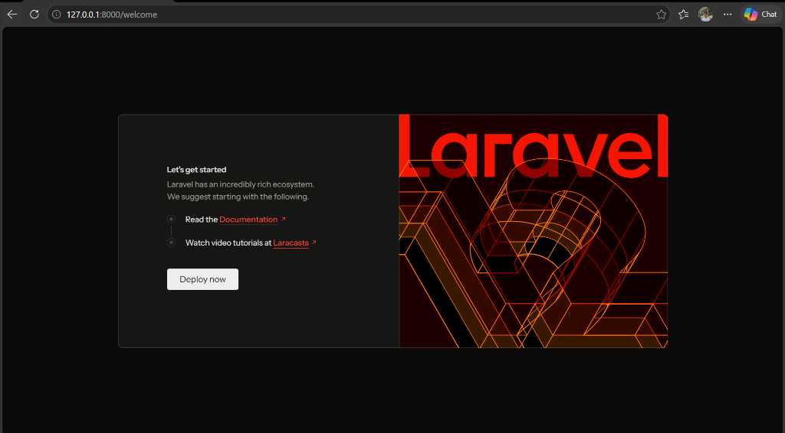

# Tugas Rutin 9 — Setup Framework Laravel

Repositori ini memuat implementasi dasar, konfigurasi lingkungan lokal, arsitektur MVC, serta sistem routing dinamis pada **Framework Laravel** sebagai pemenuhan tugas mata kuliah Pemrograman Web (Tugas Rutin 9).

---

## 🔗 Tautan Repositori

- **GitHub Repository:** [TugasWeb-P9-LaravelSetup](https://github.com/raptamayahya21-prb/TugasWeb-P9-LaravelSetup)

---


## 📌 Ringkasan Proyek

Aplikasi ini dirancang menggunakan arsitektur **Model-View-Controller (MVC)** dengan antarmuka bertema *Console / Operations Dashboard* yang memanfaatkan styling **Tailwind CSS**. Proyek ini membuktikan keberhasilan pengintegrasian infrastruktur backend lokal (PHP 8.x & MySQL via Laragon) hingga perenderan komponen tampilan Blade secara dinamis.

---

## ✅ Checklist Persyaratan Tugas (Requirements)

| No | Kriteria Tugas | Status | Keterangan / Implementasi |
| :-: | :--- | :---: | :--- |
| 1 | **Instalasi Laravel** | ✅ Done | Diinstal via Composer `composer create-project` |
| 2 | **Konfigurasi Database** | ✅ Done | Terhubung ke MySQL `myproduct_db` melalui file `.env` |
| 3 | **Eksekusi Server** | ✅ Done | Berjalan stabil via `php artisan serve` |
| 4 | **Custom Routing** | ✅ Done | Memiliki route `/`, `/about`, `/contact`, dan `/hello/{nama}` |
| 5 | **Data Dinamis View** | ✅ Done | Menerima & merender data array dinamis dari Controller |
| 6 | **Generator MVC** | ✅ Done | Tergenerasi `MainController`, `ProductController`, dan Model `Product` beserta migrasi |
| 7 | **Dokumentasi README** | ✅ Done | Penjelasan struktur folder & langkah eksekusi lengkap |
| 8 | **Repositori GitHub** | ✅ Done | Disinkronkan ke repo `TugasWeb-P9-LaravelSetup` |
| 9 | **Fitur Bonus** | ✅ Done | Styling UI Tailwind CSS CDN & Route Parameter Dinamis (`/hello/{nama}`) |

---

## 📸 Tangkapan Layar Antarmuka

### Welcome Page Laravel
Tampilan default framework Laravel setelah instalasi berhasil dan server aktif dijalankan:

<p align="center">
  
</p>

---

## 📂 Struktur Direktori Proyek

Berikut adalah struktur folder utama yang digunakan dalam proyek ini beserta penjelasannya:

```text
TugasWeb-P9-LaravelSetup/
│
├── app/                                # Kode inti aplikasi (MVC)
│   ├── Http/
│   │   ├── Controllers/
│   │   │   ├── Controller.php          # Base Controller bawaan Laravel
│   │   │   ├── MainController.php      # [CUSTOM] Logika bisnis & penyedia data array
│   │   │   └── ProductController.php   # [GENERATED] Controller via 'make:controller'
│   │   └── Middleware/                 # Filter HTTP request bawaan Laravel
│   └── Models/
│       ├── Product.php                 # [GENERATED] Model ORM Eloquent dari 'make:model Product -m'
│       └── User.php                    # Model otentikasi user bawaan
│
├── bootstrap/                          # Bootstrap framework (cache & app startup)
│   └── app.php                         # Titik konfigurasi routing & middleware
│
├── config/                             # Konfigurasi framework Laravel (app, database, session, dll.)
│
├── database/                           # Skema struktur dan migrasi database
│   └── migrations/                     # Berkas skema tabel database (termasuk products)
│
├── docs/                               # Dokumentasi dan tangkapan layar tugas
│   └── screenshots/                    # Folder penyimpanan tangkapan layar
│       └── ss-welcome.png              # Screenshot Welcome Page bawaan Laravel
│
├── public/                             # Document root web server (akses publik)
│   ├── index.php                       # Entry point aplikasi Laravel
│   └── storage/                        # Symlink ke direktori storage/app/public
│
├── resources/                          # Sumber daya tampilan (Views)
│   └── views/                          # Blade Templating Engine
│       ├── welcome.blade.php           # Halaman default Laravel (screenshot wajib)
│       ├── home.blade.php              # [CUSTOM] Tampilan Dashboard utama (/)
│       ├── about.blade.php             # [CUSTOM] Tampilan Sistem Info (/about)
│       ├── contact.blade.php           # [CUSTOM] Tampilan Kontak Ops (/contact)
│       └── hello.blade.php             # [CUSTOM] Tampilan route parameter (/hello/{nama})
│
├── routes/                             # Deklarasi routing aplikasi
│   ├── web.php                         # [MODIFIED] Definisi rute URL web browser
│   └── console.php                     # Route untuk Artisan command
│
├── storage/                            # Penyimpanan berkas runtime, log, dan cache
├── tests/                              # Unit & Feature testing (Pest / PHPUnit)
│   └── Feature/RequirementTest.php     # Pengujian otomatis seluruh rute kriteria tugas
│
├── .env                                # [MODIFIED] Konfigurasi environment & database lokal
├── .env.example                        # Template environment variabel
├── artisan                             # CLI Laravel runner
├── composer.json                       # Manifest dependensi PHP
└── README.md                           # Dokumentasi teknis proyek
```

---

## 🛠️ Panduan Instalasi & Menjalankan Proyek

Ikuti langkah-langkah di bawah ini untuk mengkloning dan menjalankan proyek ini di lingkungan lokal Anda:

### 1. Kloning Repositori

```bash
git clone https://github.com/raptamayahya21-prb/TugasWeb-P9-LaravelSetup.git
cd TugasWeb-P9-LaravelSetup
```

### 2. Pasang Dependencies Composer

```bash
composer install
```

### 3. Konfigurasi Environment File

Salin file konfigurasi contoh dan sesuaikan database `myproduct_db`:

```bash
cp .env.example .env
```

Pastikan konfigurasi database di file `.env` telah disesuaikan:

```env
DB_CONNECTION=mysql
DB_HOST=127.0.0.1
DB_PORT=3306
DB_DATABASE=myproduct_db
DB_USERNAME=root
DB_PASSWORD=
```

### 4. Generate Application Key

```bash
php artisan key:generate
```

### 5. Jalankan Storage Link & Migrasi Database

```bash
php artisan storage:link
php artisan migrate
```

### 6. Jalankan Server Lokal

```bash
php artisan serve
```

Akses aplikasi melalui peramban web pada tautan: **`http://127.0.0.1:8000`**

---

## 🧪 Pengujian Otomatis (Automated Testing)

Untuk memvalidasi bahwa seluruh rute dan data dinamis berfungsi 100%:

```bash
php artisan test
```

Hasil: **10 passed (35 assertions)**.

---

<p align="center">
  <strong>© 2026 Rapta Mayahya — Tugas Rutin 9 — Setup Laravel</strong><br>
  Mata Kuliah Pemrograman Web — Dosen: Adidtya Perdana, ST., M.KOM
</p>
